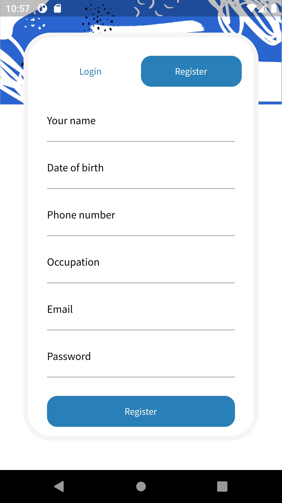
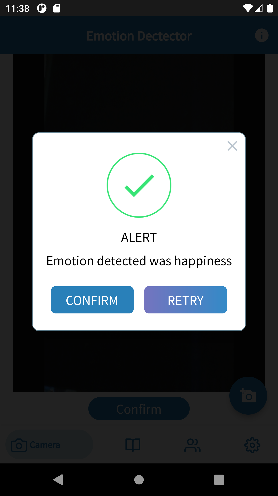
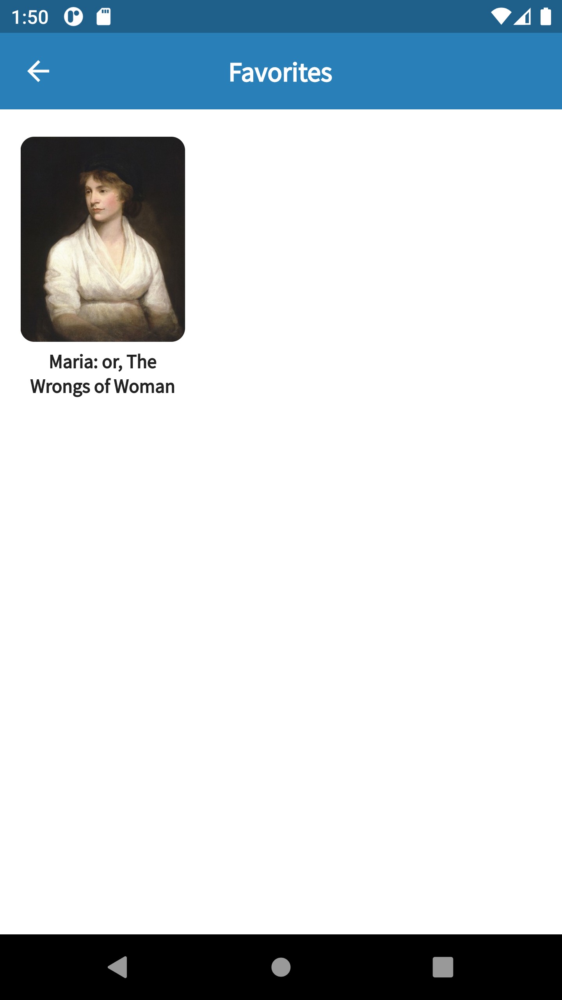

# EMETER - SOLUTION CHALLENGE 2022

A new Flutter project which provides awesome features to user based on their current emotion.

## ⭐ **Introduction**

Our group desire to design a Flutter application that can detect user's current emotion, our app can detect these following emotion:

- Anger
- Contempt
- Disgust
- Fear
- Happiness
- Neutral
- Sadness
- Surprise

Then application will create recommended music playlist or books that are suitable for user's feelings.

## 💻 **Requirements**
Running our application required internet connection.

## ✨ **Features**
- Listen to music.
- Read eBooks.
- Posting status.

## 📸 **Screenflow**

### **Authentication**

Before accessing to application features, user need to login in the `Login` tab:

If user are new to the application, they can register by filling in these below information in the `Register` tab to create a new account:

### **Main screen**

The app bar of the application provide 4 main features:

- Camera
- Book
- Feed
- Settings

#### **Camera**
In the `Camera` tab, user will provide the picture of their face, then our application start scanning and detecting the emotion.

If there is no emotion detected, application will pop an `alert` message:

Or else, emotion detected successfully, there will be a `success` message like this:

User can click the `Retry` button to retake the picture, or else user can click the `Confirm` button, the application will go into playlist interface:

In here, user can listen to the playlist which is created based on their emotion.

#### **Book**

For this section, users are able to read books which are recommend based on their emotions.

After choosing a book, a new page which contains description about the book will exist and there also provide some more book are written by the same author.

To read the book, the user first need to download it just by a press to download button and allow the application to download the book.

If user love this book and want to read it more in future, they can press the heart button on the right top corner, the book will be save into favourite section in setting.

#### **Newsfeed**

A place for users share their status or giving advice is also provided as a function in our application.

To post a status, press the pen button on the top right of the screen and user can type anything they want to share or consult from the community.

And the status will be posted on the forum.

User can also like or comment on others's post. If there's an impolite post, user can report it immediately.

#### **Setting**
This is the place for user to check what's there favourite, downloaded books or their information.

##### **Favorite**
User can find what's book they liked in here.

##### **Download**
All the books downloaded are stored in this section.

##### **About**
To show user the producer.

##### **Info**
User can see their information here.

## 